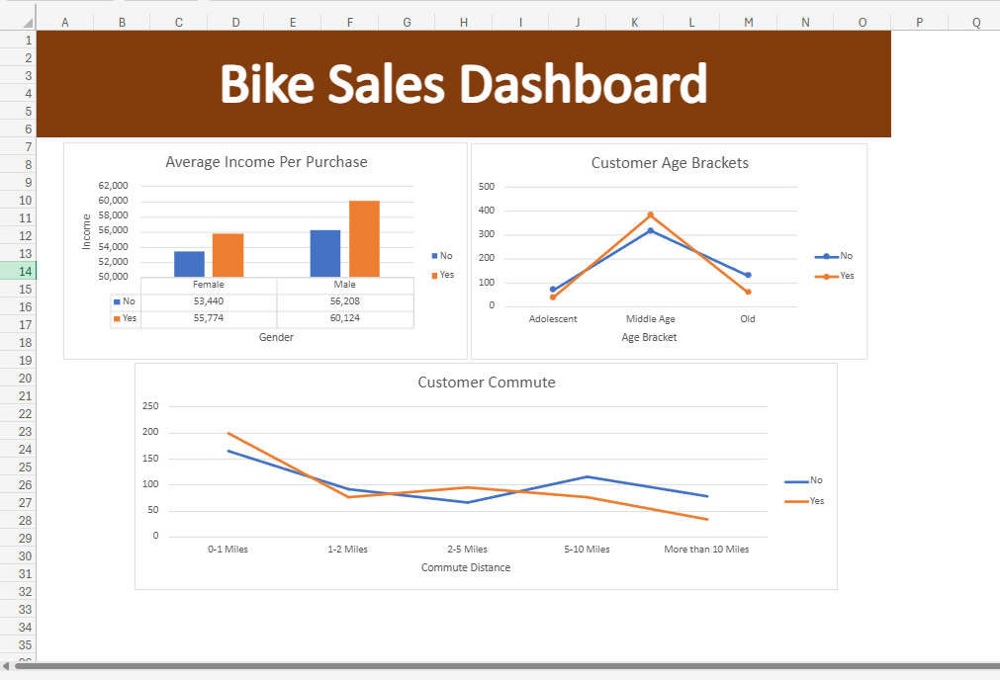

# Bike Sales Dashboard - Excel Data Analysis Project

This project is a comprehensive *Excel Dashboard* developed as part of my journey to master data analysis using Excel. The dashboard provides key business insights on customer behavior from a bike sales dataset.

---

## Table of Contents

- [Project Objective](#project-objective)
- [Dataset Overview](#dataset-overview)
- [Tools & Techniques Used](#tools--techniques-used)
- [Key Skills Demonstrated](#key-skills-demonstrated)
- [Dashboard Insights](#dashboard-insights)
- [Screenshots](#screenshots)
- [Files Included](#files-included)
- [Learning Outcome](#learning-outcome)
- [Credits](#credits)

---

## Project Objective

To transform a raw dataset into a meaningful, interactive, and visual dashboard using Excel. The focus was on practicing data cleaning, transformation, and visual storytelling with charts and pivot tables.

---

## Dataset Overview

The dataset contains attributes related to customer demographics and purchasing behavior, including:

- Gender
- Income
- Commute Distance
- Age Brackets
- Purchase Status (Yes/No)

---

## Tools & Techniques Used

- *Microsoft Excel Online*
- *Pivot Tables* for aggregation and dynamic filtering
- *Data Cleaning Techniques* (removing blanks, fixing formats)
- *Text Functions*: TRIM(), PROPER(), LOWER(), UPPER()
- *Conditional Formatting*
- *Charts*: Column Chart, Line Graph
- *Basic Excel Formulas*: IF, COUNTIF, AVERAGE, etc.
- *Dashboard Design Layout* using clean formatting and alignment

---

## Key Skills Demonstrated

- *Data Cleaning & Preprocessing*
  - Removed nulls, corrected text case, and formatted numeric values
- *Data Aggregation*
  - Used Pivot Tables to group by Gender, Commute Distance, and Age Brackets
- *Insight Generation*
  - Created comparisons between customer types (Yes/No Purchase)
- *Visualization*
  - Built an interactive dashboard to tell a clear business story
- *File Management*
  - Organized raw data, working sheets, pivot tables, and dashboard in separate tabs
- *Documentation & Version Control*
  - Uploaded project to GitHub with proper documentation and screenshot

---

## Dashboard Insights

- *Income vs Purchase*: Males and Females who purchased bikes had higher average incomes
- *Age Distribution*: Middle-aged customers were most likely to purchase bikes
- *Commute Distance*: Most customers who purchased bikes commute less than 5 miles

---

## Screenshots

---

## Files Included

- Bike_Sales_Dashboard_SagarSingh.xlsx – Excel file with raw data, cleaned data, pivot tables, and final dashboard
- Excel-Dashboard.png – High-quality image of the final dashboard

---

## Learning Outcome

This project helped me gain hands-on experience with:

- Cleaning and analyzing real-world datasets in Excel
- Creating dashboards that communicate insights effectively
- Structuring projects for GitHub portfolio visibility

---

## Credits

This project is inspired by the [Excel for Data Analysts](https://www.youtube.com/playlist?list=PLUaB-1hjhk8Hyd5NiPQ9CND82vNodlFF5) playlist by *Alex The Analyst*.
